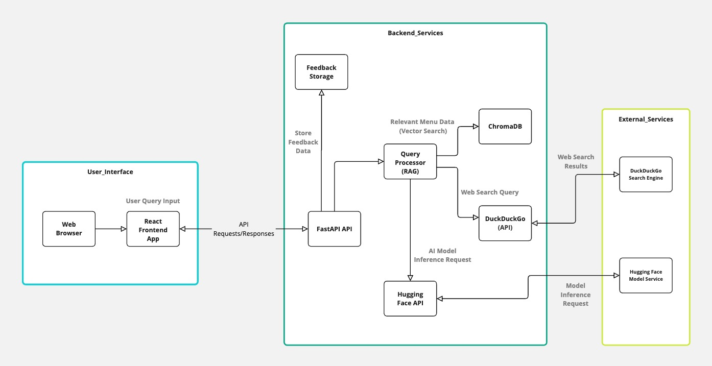
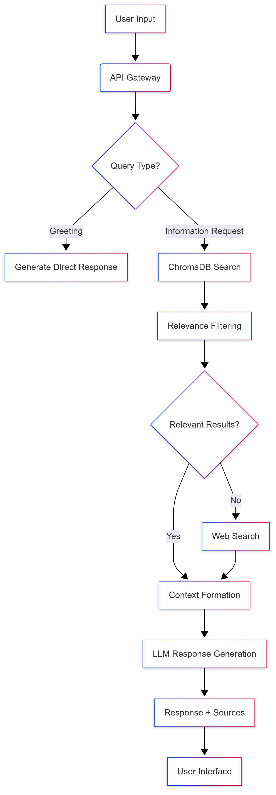

Check out the configuration reference at https://huggingface.co/docs/hub/spaces-config-reference

# Restaurant Menu RAG Chatbot 🍽️🤖

A sophisticated Retrieval-Augmented Generation (RAG) chatbot that combines local menu data with Wikipedia augmentation and web search fallback. Deployed on Hugging Face Spaces with a responsive React interface.

Try it out: https://huggingface.co/spaces/Sau24k/Menudata-RAG

![System Architecture]


## Features ✨

- **Hybrid Knowledge Base**: Combines menu data with Wikipedia restaurant information
- **Dynamic Source Integration**: 
  - Local ChromaDB vector store
  - Web search fallback (DuckDuckGo)
  - Wikipedia data augmentation
- **Intelligent Response Generation**:
  - Mistral-7B-Instruct model for answer synthesis
  - Relevance scoring for document selection
  - Context-aware conversation history
- **User Experience**:
  - Responsive design
  - Source attribution tracking
  - Feedback mechanism (👍/👎)
  - Suggested questions
  - Real-time typing indicators

## Technology Stack 🛠️

| Component              | Technology                          |
|------------------------|-------------------------------------|
| **Backend**            | Python 3.9, FastAPI, LangChain      |
| **Frontend**           | React 18, TypeScript, Tailwind CSS  |
| **Vector DB**          | ChromaDB                            |
| **Embeddings**         | all-mpnet-base-v2                   |
| **LLM**                | Mistral-7B-Instruct-v0.3            |
| **Deployment**         | Hugging Face Spaces                 |
| **Data Processing**    | Wikipedia Augmentation              |

## System Flow Diagram 📊

![System Architecture]



## Key Architecture Decisions 🏛️

### 1. Data Augmentation Pipeline
- **Wikipedia Integration**: Augmented raw menu data with restaurant background information from Wikipedia
- Processing Steps:
  1. Initial data cleaning (`menu.csv` → `cleaned_menu.csv`)
  2. Wikipedia entity matching using fuzzy string matching
  3. Data enrichment with historical/culinary context
  4. Combined dataset vectorization

```python
# Sample augmentation pseudocode
def augment_with_wikipedia(menu_items):
    for item in menu_items:
        wiki_data = fetch_wikipedia_summary(item["name"])
        item["description"] += f"\nWikipedia Context: {wiki_data}"
    return enhanced_menu
```

### 2. Multi-Source Retrieval
- **Priority Hierarchy**:
  1. Local ChromaDB (CSV + augmented Wikipedia data)
  2. Web search fallback (DuckDuckGo)
- **Relevance Threshold**: 0.5 cosine similarity cutoff

### 3. Response Generation
- Contextual prompt engineering:
  ```text
  [INST] You are a restaurant expert. Prioritize local data first.
  {context}
  Current Question: {query} [/INST]
  ```
- Temperature: 0.7 for balanced creativity/accuracy

## Installation 🛠️

### Local Development

```bash
# Clone repository
git clone https://github.com/yourusername/restaurant-rag-chatbot.git
cd restaurant-rag-chatbot

# Backend setup
python -m venv venv
source venv/bin/activate
pip install -r requirements.txt

# Frontend setup
cd frontend
npm install
npm run build
cd ..

# Run locally
uvicorn app:app --reload
```

### Docker Deployment

```bash
docker build -t rag-chatbot .
docker run -p 7860:7860 -e HUGGINGFACE_API_TOKEN=your_token rag-chatbot
```

## Configuration ⚙️

Required Environment Variables (`.env`):
```ini
HUGGINGFACE_API_TOKEN=your_hf_token
CHROMA_DB_GDRIVE_URL=your_gdrive_direct_link
PORT=7860
```

## Usage Guide 📖

1. **Basic Interaction**:
   - Type natural language questions about menu items
   - Use suggested questions for quick starts

2. **Source Verification**:
   - Click source links to verify information
   - Web results show 🔗 icon

3. **Feedback System**:
   - Rate responses with 👍/👎 buttons
   - Feedback stored in `feedback.json`

4. **Mobile Optimization**:
   - Slide-out sidebar for sources
   - Tap-to-send suggested questions
   - Responsive message bubbles

## Deployment 🚀

1. **Hugging Face Spaces**:
   - Docker template
   - Set environment variables in Settings
   - Minimum hardware: CPU Basic (upgrade for better performance)

2. **CI/CD Pipeline** (optional):
   ```yaml
   # Sample GitHub Action
   name: Deploy to HF
   on:
     push:
       branches: [main]
   jobs:
     deploy:
       runs-on: ubuntu-latest
       steps:
         - uses: huggingface/huggingface_hub@main
           with:
             hf_token: ${{ secrets.HF_TOKEN }}
   ```

---
